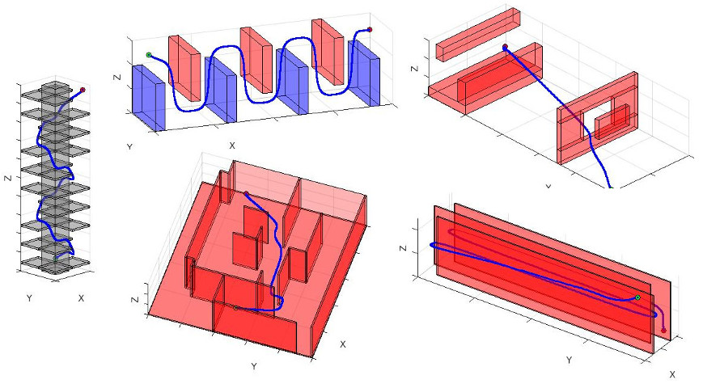
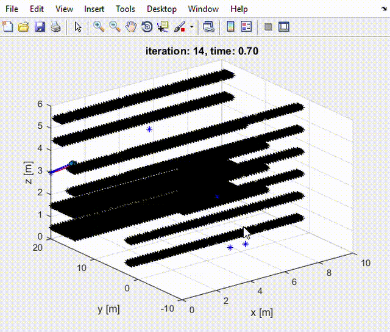

## Introduction
This project simulates the crazyflie 2.0 quadrotor in Matlab. It includes the following:

* Simulated quadrotor dynamics
* PD attitude and position controllers
* Dijikstra and A star path planners
* Minimum jerk trajectory generator
<p align="center">
 
</p>

## Results

<p align="center">
 
</p>

`Position and Velocity`
<p align="center">
 
</p>


`key`
* Blue - planned trajectory
* Red  - followed trajectory


## Execution
```
Run runsim.m in Matlab
```

## References

* MEAM 620: Advanced Robotics @ University of Pennsylvania

